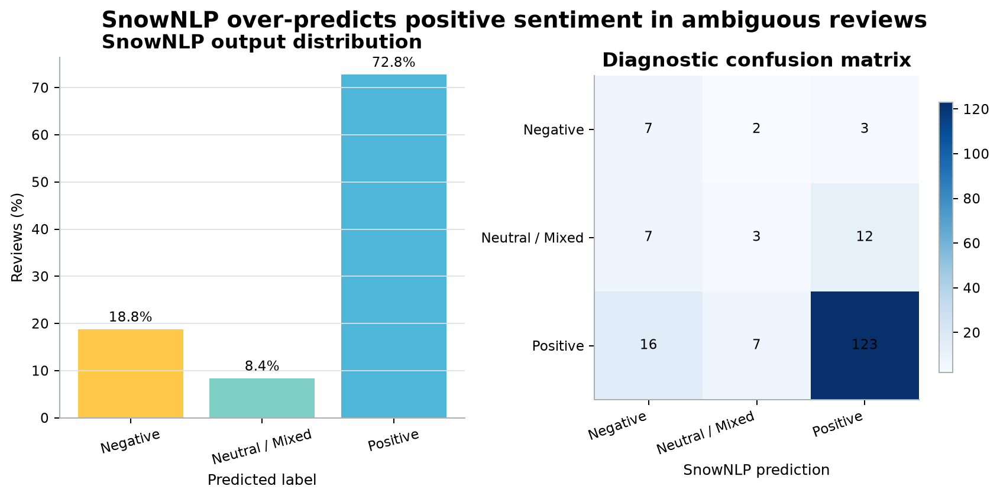

# Museum Collectibles Market and Review Analysis

This project began as an undergraduate study of museum-themed blind boxes on Taobao. I returned
to it because the original analysis had several problems: only part of the data survived, some
code was stored in Word documents, and several results could not be reproduced.

The new version keeps the undergraduate files as an archive, uses documented replacement data,
and rebuilds the analysis in Python and SQL. It looks at two separate questions:

1. What kinds of museum collectibles appear in public marketplace listings?
2. How reliable are simple methods for analyzing Chinese customer reviews?

The product and review datasets are independent. They are not joined at product level.

## Data

| Dataset | Rows | Use |
|---|---:|---|
| Undergraduate product file | 47 | Checking the earlier project |
| Undergraduate review file | 100 | Checking the earlier text analysis |
| Current product listings | 150 | Price, format, store signals, and product grouping |
| Current review sample | 500 | Topics, aspects, and sentiment |
| Manually reviewed labels | 180 | Evaluating SnowNLP sentiment predictions |

The undergraduate report mentioned 50 products and 120 reviews, but the retained files contain
47 and 100. The current 150-product dataset was collected separately on 2026-08-29 from five
saved pages of the public Hooos Taobao/Tmall index. It is not an extension of the old 47 rows.

The 500 reviews are a fixed sample from 8,107 Chinese review texts published on Figshare. That
source does not include a usable product ID, so the reviews cannot be matched to the 150 listings.

Anonymized analysis tables are available in [`data/`](data/). Sources, fields, and licensing notes
are explained in [`DATA.md`](DATA.md).

The files published on GitHub are reduced, anonymized analysis tables rather than the complete
raw datasets. Full review text, seller details, source snapshots, and private annotation notes are
not published. The original source files are required to rebuild the full pipeline from scratch.

## What the project does

The product section covers price tiers, product formats, displayed-sales coverage, and exploratory
K-Means grouping. The review section uses Chinese tokenization, LDA topic modeling, SnowNLP
sentiment scoring, manual sentiment review, and rule-based aspect extraction.

A few findings:

- 137 of 150 listings are priced at CNY 100 or below; the median price is CNY 59.
- Only 78 listings display sales figures. Missing sales are kept as missing, not changed to zero.
- K=5 is the best of the tested K-Means options, but the groups remain exploratory.
- Two broad LDA topics work better than the six-topic result in the undergraduate report.
- SnowNLP predicts 72.8% of the review sample as positive. On the manually reviewed set, accuracy
  is 0.739 and Macro F1 is 0.459, so that percentage should not be treated as customer satisfaction.

The full discussion is in [`RESULTS.md`](RESULTS.md).

## Dashboard

**[Open the interactive dashboard](https://museum-blind-box-insights.gengmengy.chatgpt.site)**

The dashboard presents the work in two parts:

- **Product Landscape** explores the 150 marketplace listings.
- **Customer Voice Lab** examines the 500 reviews and the limits of automated text analysis.

Dashboard files and local setup instructions are in [`dashboard/`](dashboard/README.md).




## Repository guide

```text
dashboard/       Interactive dashboard
data/            Public data and summary tables
figures/         Generated charts
src/             Python, SQL, settings, and stopwords
tests/           Data and reproducibility checks
```

The remaining explanations are kept in three files: [`DATA.md`](DATA.md),
[`METHODS.md`](METHODS.md), and [`RESULTS.md`](RESULTS.md).

## Run locally

Python 3.11–3.13 and [uv](https://docs.astral.sh/uv/) are recommended.

```bash
make setup
make pipeline
make public-data
make figures
make test
```

The complete pipeline requires local source snapshots that are not included in the repository
because of source and privacy restrictions.

## Limits

This is a small, source-specific sample rather than a census of the market. Listing prices may be
promotional or starting prices, sales coverage is incomplete, and seller wording cannot verify
that a store is officially authorized. The data does not support market-share, revenue, demand,
or causal claims.

Code is licensed under MIT. Third-party data keeps its original terms.
