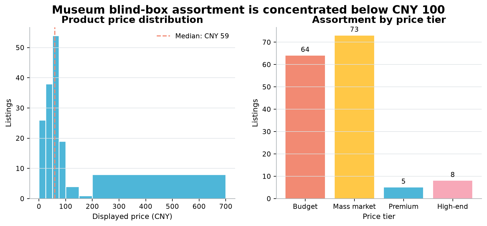
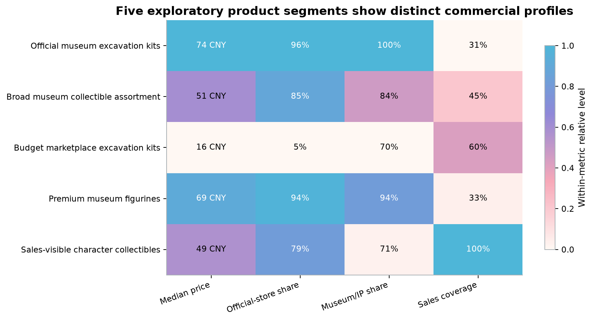

# Museum Collectibles Market and Review Analysis

This project revisits an undergraduate study of museum-themed blind boxes sold on Taobao. The
original work used product listings and Chinese reviews to study price, product types, review
topics, and sentiment. Only part of the original data and analysis files were retained, so the old
results could not all be reproduced directly.

The current version keeps the original files as an archive and rebuilds the analysis with new,
documented data sources and a reproducible Python and SQL workflow.

## Background

The undergraduate project collected Taobao data with a crawler. The retained files contain 47
product rows and 100 reviews, although the written report refers to 50 products and 120 reviews.
Some code was embedded in Word documents, and some results were available only as screenshots or
software output.

The current 150-product dataset is not the original dataset with extra rows added. It was collected
separately on 2026-08-29 from five saved pages of the public Hooos Taobao/Tmall listing index. The
old Taobao crawler was not rerun because it depended on a session cookie and was not suitable for a
reproducible public workflow.

The review analysis also uses a separate source: 500 reviews sampled from 8,107 unique Chinese
review texts in a CC BY 4.0 Figshare dataset. The published review file does not contain a usable
product identifier, so these reviews are not joined to the 150 product listings.

## Data used

| Dataset | Rows | Role in the project | Source |
|---|---:|---|---|
| Retained undergraduate products | 47 | Audit of the earlier analysis | Original local workbook |
| Retained undergraduate reviews | 100 | Audit of the earlier text analysis | Original local workbook |
| Current product listings | 150 | Price, format, store signal, and product-group analysis | Hooos public Taobao/Tmall index pages 1–5 |
| Current review sample | 500 | Topic, aspect, and sentiment analysis | Fixed sample from 8,107 Figshare reviews |
| Human sentiment evaluation set | 180 | Evaluation of SnowNLP predictions | Manually reviewed subset |

The three anonymized tables used to inspect the current analysis are in [`data/public/`](data/public/).
Full raw snapshots, review text, seller names, listing links, and annotation notes remain local.
See [`data/README.md`](data/README.md) for details.

## Analysis

The product analysis covers:

- price tiers and product formats;
- availability of displayed sales figures;
- exploratory K-Means grouping, comparing K=2 through K=6;
- cluster stability and minimum group size;
- non-parametric tests and an exploratory robust regression.

The review analysis covers:

- Chinese tokenization and LDA topic modeling;
- held-out comparison of different topic counts;
- SnowNLP sentiment scoring;
- comparison with 180 manually reviewed sentiment labels;
- rule-based aspect extraction and error analysis.

## Main results

- 137 of the 150 current listings are priced at CNY 100 or below. The median displayed price is
  CNY 59.
- Sales figures are visible for 78 listings. Missing sales values are kept as missing rather than
  treated as zero.
- K=5 gives the best result among the tested cluster counts, but the silhouette score is only
  0.283. The groups are used as exploratory product descriptions, not fixed market categories.
- The held-out LDA comparison favors two broad topics over the six-topic result reported in the
  earlier study.
- SnowNLP labels 72.8% of the 500-review sample as positive. Against the 180 manually reviewed
  labels, accuracy is 0.739 and Macro F1 is 0.459, showing weaker performance on less common
  sentiment classes.
- Packaging and logistics language is easier for the aspect rules to identify than blind-box
  outcomes and price/value judgments.

The interactive dashboard is in [`dashboard/`](dashboard/README.md). A written analysis is
available in [`reports/analysis_report.md`](reports/analysis_report.md).





## Workflow

```text
Saved source files
        ↓
Parsing and cleaning
        ↓
Validation and deterministic IDs
        ↓
Analysis-ready CSV tables and DuckDB views
        ↓
Statistical analysis and text models
        ↓
Evaluation tables, figures, and dashboard data
```

The analysis uses Python for cleaning and modeling, SQL and DuckDB for analytical views, and tests
for data quality and reproducibility. Random seeds and model ranges are stored in
[`config/analysis.yml`](config/analysis.yml).

## Run locally

Python 3.11–3.13 and [uv](https://docs.astral.sh/uv/) are recommended.

```bash
make setup
make pipeline
make public-data
make figures
make test
make lint
```

The raw source files are not included in the repository. Their expected locations and provenance
are documented under `data/raw/external/`.

## Repository structure

```text
config/          Analysis settings and Chinese stopwords
data/public/     Anonymized row-level tables and aggregate results
data/raw/        Local source files and public provenance records
docs/            Methodology, data dictionary, limitations, and audit notes
reports/         Written results and generated figures
sql/             DuckDB analytical queries
src/             Cleaning, validation, modeling, evaluation, and export code
tests/           Data-quality and reproducibility tests
dashboard/       Interactive web dashboard
```

## Limitations

This is a source-specific observational study, not a market census. Displayed prices may be
promotional or starting-SKU prices. Sales coverage is incomplete. Seller-name signals do not prove
authorization. The reviews cannot be linked to individual products, and the human sentiment set is
class-imbalanced. The results do not support causal claims, revenue estimates, or demand forecasts.

Code is licensed under MIT. Third-party data retains its original terms; see
[`THIRD_PARTY_DATA.md`](THIRD_PARTY_DATA.md).
