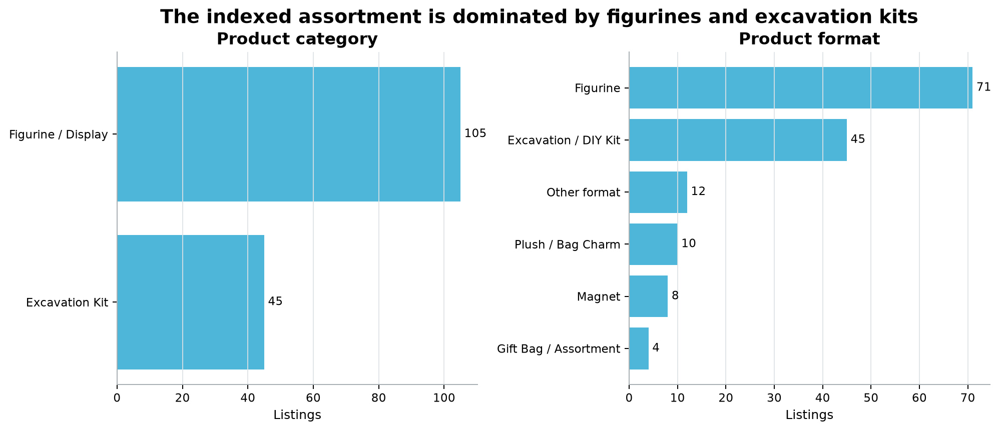
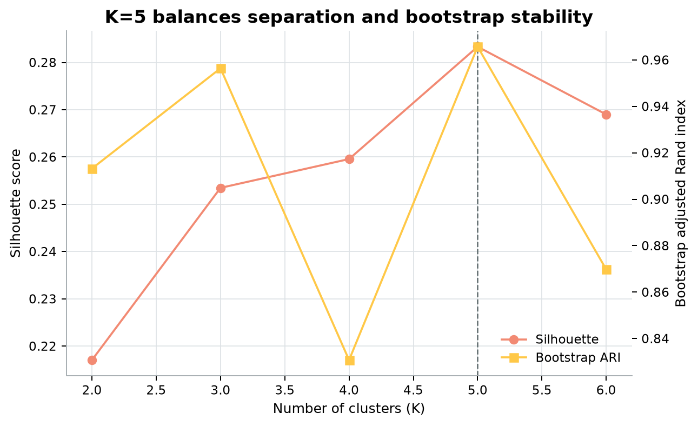
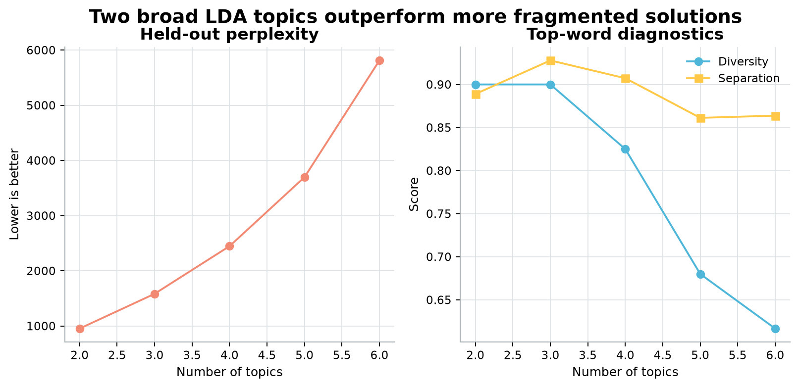
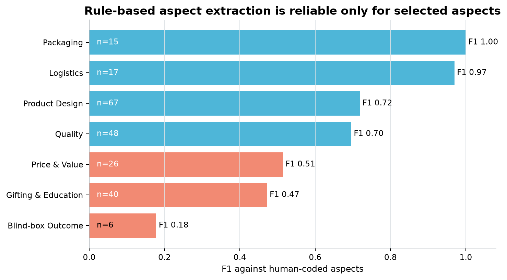

# Analysis report

## Executive summary

The expanded data supports a product-assortment story more strongly than a market-share or demand
forecasting story. Prices and formats can be compared across 150 public listings, but sales are
visible for only 78 records. The review corpus is large enough for exploratory topic and baseline
evaluation work, but the public source omits the product identifier required for SKU-level voice-
of-customer analysis.

## Product assortment

The median displayed price is CNY 59 and 137/150 listings are at or below CNY 100. Figurine/display
products account for 105 listings, while excavation kits account for 45. This supports two broad
commercial use cases: collectible/gifting products and educational/participatory kits.

## Exploratory segmentation

K=5 maximizes the configured silhouette × bootstrap-stability score and retains at least 18
products in every segment. These segments should guide assortment discussion, not authentication.

Recommended product questions:

- Should museum-led excavation kits use stronger educational positioning to differentiate them
  from budget marketplace kits?
- Can the broad collectible assortment be simplified around a smaller number of formats?
- Why is displayed-sales coverage concentrated in one collectible segment, and is this a source
  artifact or a marketplace merchandising pattern?

## Review topics and text representation

The two-topic LDA solution is broad but defensible. Higher topic counts produce fragmented term
groups and substantially worse held-out perplexity. The lightweight text-clustering comparison
selects eight clusters but reaches only about 0.11 silhouette, indicating weak natural separation
among short review texts.

## Sentiment and aspect evaluation

SnowNLP predicts 72.8% Positive, but this distribution is not a market satisfaction KPI. Against
180 user-reviewed labels, its accuracy is 0.739 and Macro F1 is 0.459. Recall is 0.842 for Positive,
0.583 for Negative, and only 0.136 for pooled Neutral/Mixed. The audit is strongly imbalanced
(146 Positive, 12 Negative, and 22 pooled Neutral/Mixed), so class-level metrics and error cases
matter more than accuracy alone.

The human coding target excludes ordinary disappointment from not drawing a preferred design.
Such statements are Neutral unless the review also evaluates controllable product or service
attributes. This scope decision separates random blind-box outcomes from product-quality sentiment.

Published human aspect coding provides a stronger evaluation source. Simple rules work well for
explicit Logistics and Packaging language, but poorly capture Blind-box Outcome and nuanced value
judgments.

## Recommended business actions

1. Treat the five product segments as assortment hypotheses and validate them using first-party
   SKU, margin, inventory, and conversion data.
2. Preserve separate positioning for educational excavation kits and collectible figurines rather
   than assuming a single blind-box customer need.
3. Route explicit packaging and logistics complaints with transparent aspect rules, but require
   human review for mixed sentiment, value judgments, and blind-box outcome language.
4. Do not use marketplace display counts as revenue or market share. Acquire timestamped SKU-level
   sales and review identifiers before demand modeling.

## Decision limits

No causal claims, authenticity classifications, product-level sentiment comparisons, revenue
estimates, or population-level satisfaction claims are supported by the current data.
